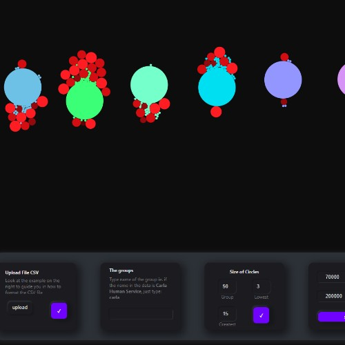

## Force Graph visualization with d3js

Upload a csv file to graph data that has a group in column A and it matches it with Column B 

## Visualization Project

- A client needed a visualization where they could group an element and see how that certain element was impacting the organization.

- The difference in color and size depens on the different fields they wanted to visualize.

- I made a dashboard where the user could enter different fields for the data

## Available Scripts

In the project directory, you can run:

### `npm start`

Runs the app in the development mode.\
Open [http://localhost:3000](http://localhost:3000) to view it in your browser.

The page will reload when you make changes.\
You may also see any lint errors in the console.

### `npm test`

Launches the test runner in the interactive watch mode.\
See the section about [running tests](https://facebook.github.io/create-react-app/docs/running-tests) for more information.

### `npm run build`

Builds the app for production to the `build` folder.\
It correctly bundles React in production mode and optimizes the build for the best performance.

The build is minified and the filenames include the hashes.\
Your app is ready to be deployed!

See the section about [deployment](https://facebook.github.io/create-react-app/docs/deployment) for more information.

